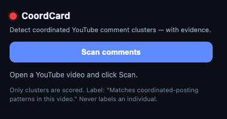

# CoordCard

**유튜브 댓글창의 조직적 댓글 무리를 탐지해, 증거와 함께 빨간 카드로 표시하는 크롬 MV3 확장 프로그램 — 개인은 절대 단정하지 않는다.**

툴바 버튼 한 번이면 현재 영상의 보이는 댓글을 스캔해, **조직적으로 거의-동일한 댓글 무리(cluster)**를 찾아 각 무리에 구체적 증거와 함께 빨간 배지를 붙입니다. 무리 밖의 단일 댓글은 절대 점수 매기지 않습니다.



---

## 1. 프로젝트 — 무엇이고, 왜 만드나

### 무엇을 만드는가
정치·상업적으로 민감한 영상의 댓글창에서 "거의 똑같은 문구가 동시에 쏟아진다"는 느낌은 받지만, 일반 사용자에게는 그걸 **검증하거나 거를 도구가 없습니다.** CoordCard는 현재 영상의 보이는 댓글에 군집 탐지를 돌리고, 무리에 속한 댓글에만 **"이 영상에서 조직적 게시 패턴과 일치"**라는 정직한 라벨 + 증거(무리 크기·신호)를 붙입니다.

### 왜 이게 문제인가 — 측정된 사실
댓글 여론조작은 "느낌"이 아니라 플랫폼·보안기관·학계가 **반복 측정한 실재 현상**입니다.

| 사실 | 출처 |
|---|---|
| Google TAG가 2026년 1분기 **한 분기에만** PRC 연계 유튜브 채널 **2,254 + 2,602 + 1,096개** 종료 | blog.google TAG Q1 2026 |
| DRAGONBRIDGE/Spamouflage 채널의 **80%가 구독자 0명**, 영상 65%가 조회수 100 미만 — **자기들끼리의 댓글 루프**로 활동 | Google TAG |
| Mandiant 2022: 사칭 계정들이 **같은 달에 일괄 생성**, 아바타 공유, **거의 동일 텍스트** 게시 | Mandiant |
| 한국 학술연구 2024: 의심 계정 **239개** — 한 기사에 댓글 **2,698개**, 한 계정이 **하루 130개** 댓글 | yna.co.kr AEN20240927 |

**문제는 실재하고(측정됨), 사용자는 도구가 없고(신고 버튼뿐), 수법은 알고리즘이 잡을 만큼 정형적입니다.** 일괄 생성 계정 · 공유 아바타 · 거의 동일 텍스트 · 짧은 시간 버스트 · 자기들끼리 리플 — 이 **측정 가능한 패턴**을 CoordCard가 결정적 알고리즘으로 잡습니다.

### 정직성 제약 (절대 규칙)
- 단일 댓글을 따로 점수 매기지 않습니다 — 그건 범주 오류입니다. **탐지된 무리에 속할 때만** 표시합니다.
- 라벨은 오직 **"Matches coordinated-posting patterns in this video"** 하나뿐.
- `bot / 외국인 / 특정 국적 / 공작 / 간첩` 같은 단어는 코드·번들 어디에도 못 쓰게 `forbidden-words.spec`이 강제합니다.
- 비목표: IP 추적 ✗ · 영상 간 댓글 이력 집계 ✗ · 자동 신고 제출 ✗ · 개인을 금지어로 라벨링 ✗ · ML 모델 ✗.

### 점수 알고리즘 v2 (결정적 공식)
"무엇이 조직적인가"는 추측이 아니라 결정적 공식으로 정의됩니다.

- **군집 구성**: 정규화(소문자·URL·이모지·구두점 제거·NFKC) 후 **글자 4-gram Jaccard 유사도**. `sim ≥ 0.70`이면 "거의 중복" → union-find로 무리 형성. 글자 단위라 바꿔쓰기·띄어쓰기·유사문자까지 잡습니다. 5토큰 미만(ㅋㅋㅋ, lol)은 스킵.
- **4개 신호**: `T` 텍스트 중복 강도 · `B` 시간 버스트(상대시각 버킷) · `R` 리플라이-링(같은 문구가 여러 스레드에 복제) · `A` 계정 신규성(API 모드 한정).
- **유기적 버스트 억제기**: 추도(RIP·고인의 명복)·웃음 폭주·**팬덤 떼창 사전(93토큰)**·이모지 밀도 ≥0.30 → `SUPP=true`면 점수와 무관하게 **표시 안 함**. (떼창을 조작으로 매도하지 않기 위한 결정적 가드)
- **합성 점수(no-API)**: `S = 0.50·T + 0.30·B + 0.20·R`
- **플래그 4중 가드**: `S ≥ 0.70` 그리고 무리 크기 ≥ 3 그리고 신호 2개 이상 양수 그리고 `SUPP=false`.

**17행 합성 픽스처 = 결정적 정답지**:

| 군집 | 구성 | S | 판정 | 증명 |
|---|---|---|---|---|
| X | 동일 문구 5인 | 0.80 | **FLAGGED** | 정상 플래그 경로 |
| Z | 리플라이-링 3인 | 0.68 | NOT | 소규모 과탐 방지 (0.70 미만) |
| M | 팬덤 떼창 5인 | 0.80 | **SUPPRESSED** | 억제기가 0.80도 차단 |

잡을 건 잡고(X), 작은 건 안 잡고(Z), 떼창은 막는다(M).

---

## 2. 화면 데모 설명

위 스크린샷(`docs/demo.png`)은 **실제 파이프라인**(`runScan(document)` → scrape → cluster → score → injectBadges)을 실제 유튜브 영상 DOM에 돌린 결과입니다. 한 화면에 알고리즘의 세 경로가 모두 보입니다:

- **🔴 빨간 배지 (군집 X — FLAGGED)**: `@user8x3k1`, `@k9m2x7q`, `@zz1p4w8`, `@x7q2k9m1`, `@q7w8e9r2` — 5명의 서로 다른 계정이 **"이 영상 정말 최고예요 꼭 보세요 추천합니다"**라는 동일 문구를 짧은 시간에 게시. `S = 0.80`으로 플래그되어 각 댓글에 **"Matches coordinated-posting patterns in this video — 80% · 5 near-duplicate comments in the same recent window"** 배지가 붙습니다.
- **⚪ 배지 없음 (organic — 정직성)**: `@normaluser`의 "저는 이 의견에 동의하지 않습니다 근거가 부족해 보이네요" — 무리에 속하지 않은 정상 반대 의견. **배지가 붙지 않습니다.** 단순히 동의하지 않는 댓글을 조작으로 매도하지 않는다는 증명.
- **🛡️ 억제됨 (군집 M — SUPPRESSED)**: `@bts_fan_kr`, `@army4ever`의 "오빠 정국 사랑해 영원히 응원할게 보라해 아미" — 5명이 동일 문구라 `S=0.80`이지만, **팬덤 떼창 사전**이 잡아서 표시되지 않습니다. 팬챈트를 조작으로 오탐하지 않는다는 증명.

> 주: 데모의 군집은 시연용 합성 데이터입니다. 실제 이 영상의 댓글은 organic해서 라이브 스캔 시 0개 플래그였습니다 — CoordCard는 **없는 조작을 지어내지 않습니다.** 이 화면은 "조작이 있었다면 이렇게 표시된다"의 시연입니다.

### 직접 써보기
```
1. pnpm i && pnpm build
2. chrome://extensions → 개발자 모드 켜기 → "압축해제된 확장 프로그램을 로드" → dist/ 폴더 선택
3. 툴바에 CoordCard 아이콘 표시됨
4. 유튜브 영상(watch?v=...) 열고 댓글 스크롤로 로드
5. CoordCard 아이콘 클릭 → Scan
```

---

## 3. 하네스 로직 — 이 확장을 90분 무인으로 만든 구조

이 확장은 사람이 코드를 친 게 아니라, **랄프톤 하네스**(Claude Code 플러그인)가 엔터 한 번에 90분 동안 사람 손 없이 빌드했습니다. 하네스는 제품이 아니라 **AI가 그 제품을 표류·정지·파괴·예산소진 없이 끝까지 만들도록 강제하는 실행 구조**입니다.

핵심 통찰: **"루프를 안 멈추게 하는 것"과 "루프를 목적지로 수렴시키는 것"은 다른 문제.** Stop 훅이 추진력(안 멈춤)을 주고, 그 위에 다섯 개의 벽이 방향을 줍니다.

### 막아야 할 4대 실패 모드
| 실패 모드 | 차단 |
|---|---|
| 표류 (drift) — 미션 잊고 엉뚱한 걸 만듦 | SessionStart 앵커로 미션 재주입 |
| 조기 정지 (early stop) — "다음 뭐할까요" 하고 멈춤 | Stop 훅 루프로 차단 |
| 데이터 파괴 (destruction) — 누적 자산 덮어씀 | PreToolUse veto + 멱등 부트스트랩 |
| 예산 소진 (budget burn) — 느린 검증에 시간 태움 | 검증 사다리 + 스코프 거버너 |

### 다섯 개의 벽 (8개 스크립트)
각 훅은 stdin JSON을 `jq`로 파싱하고 **진짜로 차단/주입**합니다 (환경변수·프롬프트 부탁이 아니라 — 이게 안티패턴 회피의 핵심).

| 벽 | 이벤트 | 역할 |
|---|---|---|
| 미션 앵커 | SessionStart | 매 시작·압축마다 미션 재주입, 현재 슬라이스 splice |
| 도구 veto | PreToolUse | PRD 수정·`rm -rf` 차단 (`permissionDecision:deny`) |
| 출력 검증 | PostToolUse | 실패 테스트·금지어를 다음 턴 컨텍스트로 경고 |
| 스코프 거버너 | PostToolUse | T+30/60/75/85 시간대별 자동 스코프 컷 |
| 무결성 감시 | PostToolUse | "존재만 하는 테스트"·"플래키 테스트" 탐지 |
| 압축 가드 | PreCompact | 압축 직전 디스크 상태를 가리키도록 리마인드 |
| 루프 엔진 | Stop | 계속하려면 block, 8회 천장 전 항복, DONE/ABORT면 정지 |
| 부트스트랩 | 명령 `[0]` | 작업 저장소 시드 (`bootstrap.sh`) |

### 루프 엔진 (Stop 훅) — 가장 중요한 코드
Claude Code 공식 Stop 훅 의미론을 정확히 따릅니다. 결정 순서:
1. `stop_hook_active == true` → exit 0, 빈 출력 (무한루프 가드)
2. `DONE`/`ABORT` 센티넬 존재 → exit 0, 빈 출력 (세션 정지 허용)
3. `stall_count ≥ 7` → exit 0 + ABORT 기록 (Claude의 8회 자동 override 전에 스스로 항복)
4. 그 외 → block + `continue.md`를 다음 행동으로 주입

> 왜 8회 천장 전에 항복하나: Claude Code는 Stop 훅이 8번 연속 block하면 자동 override해 통제권을 가져갑니다. 그래서 같은 실패가 7사이클 반복되면 스스로 멈추고 ABORT를 써서 강제 override 전에 깨끗하게 손을 뗍니다.

### 블랙보드 — 디스크가 곧 기억
모든 상태가 컨텍스트가 아니라 `.harness/`에 있어, 컨텍스트가 압축돼도/세션이 죽어도 다음 사이클이 디스크에서 그대로 이어받습니다: `start_ts`(예산 시계) · `state.md`(현재 슬라이스) · `progress.md`(append-only 로그) · `results.jsonl`(검증 기록) · `continue.md`(다음 행동) · `scope.json`(컷 기록) · `bootstrap.ok`(시드 증명) · `DONE`/`ABORT`(센티넬).

### 스코프 거버너 — 예산 자동 관리 (순수 bash, LLM 판단 없음)
| 시점 | 조건 | 액션 |
|---|---|---|
| T+30 | V0~V6 미완 | V11(신고)·V10(블록리스트) 드롭 |
| T+60 | V7 미완 | V9·V8 드롭, V7 집중 |
| T+75 | V7 여전히 미완 | logic-only 데모로 freeze |
| T+85 | 최종 | §10.A 체크 → DONE 또는 ABORT |

### 검증 3단 사다리 (싼 것 먼저)
**L1** Vitest 합성 픽스처(결정적 차단 게이트) → **L2** playwright 실유튜브 스모크(비차단, chromium 없으면 skip+로그) → **Codex** 코드리뷰. L1만이 유일한 "출하됨" 게이트입니다.

### "출하됨(Shipped)"의 정의 — §10.A
의견이 아니라 **8개의 이진 셸 체크**: `pnpm test`(스펙 10+) · `pnpm build`+`dist/manifest.json`(MV3) · 매니페스트 정적검사 · L1 픽스처 · L2 스모크(통과 또는 skip) · jsdom 인젝터 스모크 · `forbidden-words.spec`(src+dist) · `pnpm package`→zip. **8개 전부 통과해야만 DONE.**

---

## 검증 명령
```
pnpm test            # 단위 테스트 (알고리즘 결정적 정답지 포함)
pnpm build           # dist/manifest.json (manifest_version 3)
pnpm validate:ship   # MV3 + youtube matches + 권한 검사
pnpm package         # coordcard-0.1.0.zip
```

## 라이선스
MIT
